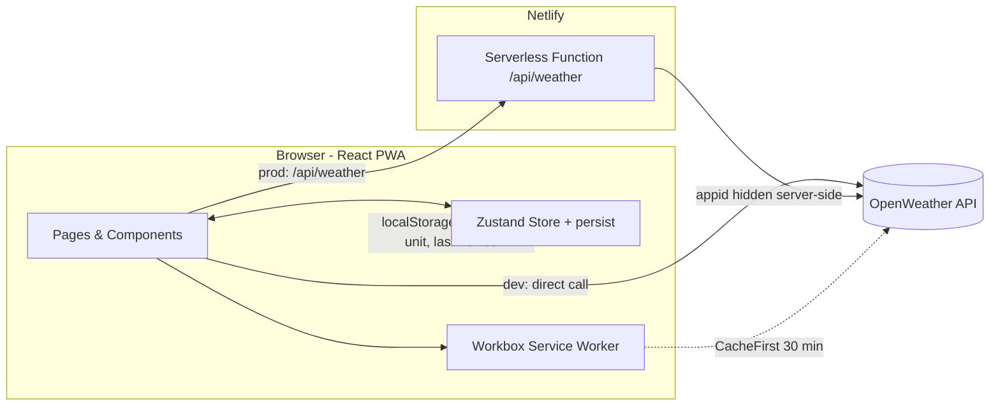

# Weather App Advanced — Step-by-Step Build Guide

> **Archived: original build playbook.** This document is the original roadmap used to build Weather App Advanced. It captures the intended phases, decisions, and implementation notes in the order they were meant to be executed. The codebase may have evolved since this guide was written, so for the current setup, architecture, scripts, and deployment details always defer to [../README.md](../README.md).

---

> **Project Summary:** Weather App Advanced is a modern, installable Progressive Web App for worldwide weather forecasting. It lets users search any city or use geolocation to view current conditions, a 24-hour hourly forecast, a 5-day daily forecast, and a real-time Air Quality Index with per-pollutant breakdowns. Temperature trends and weather conditions are visualized with interactive charts, favorite cities are persisted locally for quick access, and units can be toggled between Celsius and Fahrenheit. The OpenWeather API key is never exposed to the browser: in production all requests are proxied through a Netlify serverless function, while local development can call the API directly. The app ships a glassmorphism dark UI, full responsiveness, offline support through a Workbox service worker, and persistent state via Zustand. Stack: React 18, TypeScript, Vite 6, Tailwind CSS 3, Zustand 5, React Router v6, React Hook Form, Zod, Recharts, Axios, Lucide React, vite-plugin-pwa, and Netlify Functions.

Each step below is a self-contained prompt. Execute them in order.

Stack: React 18 + TypeScript + Vite 6, Tailwind CSS 3, Zustand 5, React Router v6, React Hook Form + Zod, Recharts, Axios, Lucide React, vite-plugin-pwa (Workbox), Netlify Functions, OpenWeather API.

---

## Table of Contents

**PHASE 1 — Project Foundation**

- STEP 1 — Project Scaffolding & Dependency Setup
- STEP 2 — Tooling, Path Aliases & Tailwind Theme
- STEP 3 — PWA & Build Configuration

**PHASE 2 — Core Data Layer**

- STEP 4 — Domain Types
- STEP 5 — Utility Functions
- STEP 6 — Netlify Serverless Weather Proxy
- STEP 7 — Weather API Service
- STEP 8 — Zustand Weather Store

**PHASE 3 — UI Foundation**

- STEP 9 — Base UI Primitives (Toast, Alert, Skeleton)
- STEP 10 — Application Layout & Navigation

**PHASE 4 — Feature Components & Pages**

- STEP 11 — Search Form
- STEP 12 — Current Weather & Air Quality
- STEP 13 — Forecast (Hourly & 5-Day)
- STEP 14 — Weather Charts
- STEP 15 — Favorites
- STEP 16 — Pages & Routing (Home, Favorites, City Detail)

**PHASE 5 — Polish & Deploy**

- STEP 17 — PWA Registration & Offline Behavior
- STEP 18 — Netlify Deployment & Documentation

**Appendices**

- Appendix A — Shared Constants & Conventions
- Appendix B — Common Pitfalls
- Appendix C — Pre-Flight Checklist

---

## Global Build Rules (apply to EVERY step)

- **No git operations.** Do not run `git` commands, do not stage, commit, or push. Version control is handled manually by the user.
- Do not install unapproved packages. Only add a dependency when the step explicitly requires it.
- Do not run long-running processes (dev servers, watchers) unless the step or the user asks for it.
- Treat every step as self-contained: state the goal, the files touched, the dependencies needed, and the acceptance criteria.
- Write clean, readable, modern code: ES6+, React Hooks, functional components, `async/await`.
- Use English for all identifiers, filenames, comments, and documentation.
- Prefer native methods over new dependencies; keep components reusable (DRY).
- Treat security, accessibility (a11y), and performance as first-class requirements in every step.
- Keep the API key server-side only; never embed it in client bundles for production.

---

## Architecture at a Glance

- **Client**: React + TypeScript single-page app. Routing via React Router. UI state and persisted data are centralized in a Zustand store.
- **State**: The store holds current weather, forecast, air quality, favorites, unit, loading/error flags, and a `lastViewed` snapshot for offline display. Favorites, unit, and `lastViewed` are persisted to `localStorage`.
- **API access**: In development the client can call OpenWeather directly using `VITE_OPENWEATHER_API_KEY`. In production it calls the relative `/api/weather` endpoint, which `netlify.toml` redirects to the serverless function that injects the secret `OPENWEATHER_API_KEY`.
- **Offline**: A Workbox service worker precaches the app shell and applies a `CacheFirst` strategy (30-minute expiration) to OpenWeather responses.

---

# PHASE 1 — PROJECT FOUNDATION

---

## STEP 1 — Project Scaffolding & Dependency Setup

**Goal:** Create a Vite + React + TypeScript project and install runtime and dev dependencies.

**Files/folders to create or edit:**

- `package.json`, `tsconfig.json`, `tsconfig.node.json`, `tsconfig.functions.json`
- `index.html`, `src/main.tsx`, `src/App.tsx`, `src/vite-env.d.ts`

**Dependencies:**

- Runtime: `react`, `react-dom`, `react-router-dom`, `zustand`, `axios`, `react-hook-form`, `@hookform/resolvers`, `zod`, `recharts`, `lucide-react`, `clsx`, `tailwind-merge`, `class-variance-authority`
- Dev: `vite`, `@vitejs/plugin-react`, `typescript`, `@types/react`, `@types/react-dom`, `@types/node`, `tailwindcss`, `postcss`, `autoprefixer`, `vite-plugin-pwa`, `workbox-window`, ESLint stack, `@netlify/functions`, `netlify-cli`

**Implementation notes:**

- Use `"type": "module"` and Vite scripts: `dev`, `build` (`tsc -b && vite build`), `lint`, `preview`, plus `dev:netlify` for the proxied environment.
- `index.html` mounts `#root` and loads Google Fonts (`Outfit`, `Syne`).
- `main.tsx` renders `<App />` inside `<BrowserRouter>` and `<StrictMode>`.

**Acceptance checklist:**

- `npm run dev` serves a blank app without TypeScript errors.
- `npm run build` completes with `tsc -b` passing.

---

## STEP 2 — Tooling, Path Aliases & Tailwind Theme

**Goal:** Configure the `@` path alias and the Tailwind design system used across the UI.

**Files/folders to create or edit:**

- `vite.config.ts` (alias `@` → `./src`)
- `tailwind.config.js`, `postcss.config.js`, `src/index.css`

**Implementation notes:**

- Define custom color scales: `weather` (sky blues), `sunny` (warm yellows/oranges), and `storm` (dark slates) used for the dark glassmorphism theme.
- Register font families (`font-display` for headings).
- In `index.css`, define reusable component classes with `@layer components`: `glass`, `glass-card`, `btn-primary`, `btn-secondary`, `btn-ghost`, `input-field`, `gradient-text`, and animation utilities (`animate-slide-up`, `animate-fade-in`, `animate-float`, `animate-slide-down`).

**Acceptance checklist:**

- Tailwind classes compile; custom colors and component classes are available.
- Importing from `@/...` resolves correctly in both app and build.

---

## STEP 3 — PWA & Build Configuration

**Goal:** Make the app installable and offline-capable.

**Files/folders to create or edit:**

- `vite.config.ts` (`VitePWA` plugin), `public/pwa-icon.svg`, `public/weather-icon.svg`

**Implementation notes:**

- Configure `VitePWA` with `registerType: 'autoUpdate'`, a web app manifest (name, theme/background `#0f172a`, `standalone`, icons), and Workbox `runtimeCaching`.
- Runtime cache rule: match `https://api.openweathermap.org/*` with `CacheFirst`, cache name `weather-api-cache`, `maxEntries: 50`, `maxAgeSeconds: 60 * 30`, `cacheableResponse.statuses: [0, 200]`.
- Precache `js,css,html,ico,png,svg,woff2`.

**Acceptance checklist:**

- A production build emits `sw.js`, `workbox-*.js`, and `manifest.webmanifest` in `dist/`.

---

# PHASE 2 — CORE DATA LAYER

---

## STEP 4 — Domain Types

**Goal:** Model the OpenWeather responses and app-specific structures with strict TypeScript.

**Files/folders to create or edit:**

- `src/types/weather.ts`

**Implementation notes:**

- Define `CurrentWeatherResponse`, `ForecastResponse`, `ForecastItem`, `CityData`, `MainWeatherData`, `WindData`, `Coordinates`, `WeatherCondition`, and precipitation/system sub-types.
- Define app types: `FavoriteCity`, `ProcessedForecast`, `UnitSystem` (`'metric' | 'imperial'`), `WeatherCategory`, `ApiError`.
- Define air quality types: `AirQualityResponse`, `AirQualityData` (`aqi: 1..5`), `AirQualityComponents`, and `AQILevel` for UI metadata.

**Acceptance checklist:**

- All later modules import types from `@/types/weather` without `any`.

---

## STEP 5 — Utility Functions

**Goal:** Centralize formatting and derivation helpers (DRY).

**Files/folders to create or edit:**

- `src/lib/utils.ts`

**Implementation notes:**

- `cn(...)` merges classes via `clsx` + `tailwind-merge`.
- Weather helpers: `getWeatherCategory`, `getWeatherGradient`, `getWeatherIconUrl`, `isNightTime`, `getWindDirection`.
- Formatters: `formatTemp`, `formatWindSpeed`, `formatDate`, `formatTime`, `getDayName`.
- `processForecast` groups the 3-hour forecast list into up to 5 daily summaries (min/max/avg temp, midday icon, humidity, wind, max precipitation probability) with defensive guards.
- `generateId` uses `crypto.randomUUID()` with a safe fallback.
- `debounce` for input throttling.

**Acceptance checklist:**

- Functions are pure, typed, and guard against missing/partial data.

---

## STEP 6 — Netlify Serverless Weather Proxy

**Goal:** Keep the API key server-side by proxying OpenWeather requests.

**Files/folders to create or edit:**

- `netlify/functions/weather.ts`, `netlify.toml`, `tsconfig.functions.json`

**Implementation notes:**

- Read `OPENWEATHER_API_KEY` from `process.env`; return a 500 if missing.
- Accept query params: `q`/`city`, `lat`, `lon`, `type` (`weather` | `forecast` | `air_pollution`), `units`.
- Handle CORS preflight (`OPTIONS`) and restrict to `GET`.
- Branch on `type`: `air_pollution` requires `lat`/`lon`; weather/forecast accept a city name or coordinates.
- Forward upstream errors with their status and message; never leak the key.
- In `netlify.toml`, redirect `/api/*` → `/.netlify/functions/:splat` (status 200) **before** the SPA fallback `/*` → `/index.html`.

**Security/validation:**

- Validate required parameters and return `400` with a clear message when missing.
- Order of redirects matters: the API proxy rule must precede the SPA catch-all.

**Acceptance checklist:**

- `netlify dev` serves `/api/weather?q=London` and returns OpenWeather JSON without exposing the key.

---

## STEP 7 — Weather API Service

**Goal:** Provide a single typed client the app uses for all weather data.

**Files/folders to create or edit:**

- `src/services/weatherApi.ts`

**Implementation notes:**

- Detect environment: use direct OpenWeather calls when `import.meta.env.DEV` and `VITE_OPENWEATHER_API_KEY` are set; otherwise route through `/api/weather`.
- `buildUrl(endpoint, params)` constructs either a direct OpenWeather URL (with `appid`) or a Netlify function URL (with `type`).
- Methods: `getCurrentWeather`, `getCurrentWeatherByCoords`, `getForecast`, `getForecastByCoords`, `getAirQuality`, `getCurrentLocationWeather` (Geolocation API).
- Use a single Axios instance with a 10s timeout. Centralize error mapping in `handleApiError` (city-not-found, invalid key, timeout, network, generic).

**Acceptance checklist:**

- Each method returns typed data and throws user-friendly `Error` messages on failure.

---

## STEP 8 — Zustand Weather Store

**Goal:** Centralize state, data fetching, favorites, and settings with persistence.

**Files/folders to create or edit:**

- `src/store/weatherStore.ts`

**Implementation notes:**

- State: `currentCity`, `currentWeather`, `forecast`, `airQuality`, `favorites`, `loading`, `error`, `unit`, `lastViewed`.
- Add a private `loadWeatherBundle(weatherPromise, forecastPromise)` helper that fetches weather + forecast in parallel and then air quality (optional, non-fatal). Reuse it everywhere to stay DRY.
- Actions: `searchCity(name)`, `fetchByCoords(lat, lon, label)`, `loadFavoriteWeather(favorite)` (delegates to `fetchByCoords`), `clearSearch`, `addFavorite`, `removeFavorite`, `isFavorite`, `setUnit`, `clearError`.
- `setUnit` must refetch by **coordinates** of the current city (not by name) to avoid resolving a different city with the same name.
- Persist only `favorites`, `unit`, and `lastViewed` via `persist` (`partialize`), store name `weather-storage`.

**Acceptance checklist:**

- Searching, switching units, and reloading the page preserve favorites and last view.
- A failed air quality request does not break the weather flow.

---

# PHASE 3 — UI FOUNDATION

---

## STEP 9 — Base UI Primitives (Toast, Alert, Skeleton)

**Goal:** Build reusable, accessible feedback components.

**Files/folders to create or edit:**

- `src/components/ui/Toast.tsx`, `src/components/ui/Alert.tsx`, `src/components/ui/Skeleton.tsx`

**Implementation notes:**

- `Toast`: a `ToastContainer` plus a `toast` API (`success`, `error`, `info`) with auto-dismiss.
- `Alert`: `ErrorAlert` (message, `onDismiss`, `onRetry`) and `EmptyState` (icon, title, description, optional action).
- `Skeleton`: `WeatherCardSkeleton` and `ForecastCardSkeleton` loading placeholders.

**Accessibility:**

- Provide `aria-label`s for icon-only buttons and ensure toasts are announced.

**Acceptance checklist:**

- Components render in isolation and are consumed by pages in later steps.

---

## STEP 10 — Application Layout & Navigation

**Goal:** Provide the shell: header navigation, unit toggle, and footer.

**Files/folders to create or edit:**

- `src/components/Layout.tsx`

**Implementation notes:**

- `Header` with logo, desktop nav (`Weather`, `Favorites` with a count badge), a Celsius/Fahrenheit toggle, and a mobile menu.
- `Footer` with attribution and an offline-ready indicator.
- `Layout` wraps `children` between header and footer using a sticky, glass header.

**Accessibility:**

- Mark the active route, label the menu and unit toggles, and keep tap targets adequate.

**Acceptance checklist:**

- Navigation works on desktop and mobile; the unit toggle updates the store.

---

# PHASE 4 — FEATURE COMPONENTS & PAGES

---

## STEP 11 — Search Form

**Goal:** Validated city search plus current-location lookup.

**Files/folders to create or edit:**

- `src/components/SearchForm.tsx`

**Implementation notes:**

- Use React Hook Form + Zod (`city`: 2–100 chars, letters/spaces/`-',.`).
- On submit, call `searchCity`. Add a geolocation button that calls `getCurrentLocationWeather`, then updates the store and shows a toast.
- Read `currentCity` reactively from the store (not `getState()`) so the clear button re-renders correctly.

**Accessibility:**

- Label the location and clear buttons; disable inputs while loading.

**Acceptance checklist:**

- Invalid input shows inline errors; valid input fetches weather.

---

## STEP 12 — Current Weather & Air Quality

**Goal:** Show current conditions and the Air Quality Index.

**Files/folders to create or edit:**

- `src/components/CurrentWeather.tsx`, `src/components/AirQuality.tsx`

**Implementation notes:**

- `CurrentWeather`: city header, favorite toggle, large temperature, description, H/L, and a stats grid (feels-like, humidity, wind + direction, visibility, sunrise/sunset). Apply a weather/time-based gradient and guard against partial data.
- `AirQuality`: map AQI 1–5 to label/color/description, render a gradient scale with an indicator, and a pollutants grid (PM2.5, PM10, NO2, O3, SO2, CO).

**Acceptance checklist:**

- Favorite toggling reflects store state; AQI indicator position matches the level.

---

## STEP 13 — Forecast (Hourly & 5-Day)

**Goal:** Present near-term and multi-day forecasts.

**Files/folders to create or edit:**

- `src/components/Forecast.tsx`

**Implementation notes:**

- `HourlyForecastPreview`: horizontally scrollable next 8 entries with time, icon, temperature, and precipitation chance.
- `Forecast`: 5-day summary using `processForecast`, with day name, icon, precipitation, and a min–max temperature bar.
- Skip items with missing weather data.

**Acceptance checklist:**

- Both views render from the same forecast list and respect the selected unit.

---

## STEP 14 — Weather Charts

**Goal:** Visualize temperature and conditions with Recharts.

**Files/folders to create or edit:**

- `src/components/WeatherChart.tsx`

**Implementation notes:**

- `TemperatureChart`: area chart of `temp` and `feelsLike` for the next 24 hours, plus min/max/avg summary.
- `WeatherConditionsChart`: bar chart of `humidity` and `rainChance` (normalize `pop` 0–1 to a percentage so it shares the `%` axis).
- Use a shared, unit-aware `CustomTooltip` (passed `unit` as a prop) with a `seriesLabels` map so temperature shows `C`/`F`, wind shows `m/s`/`mph`, and `feelsLike` is labeled.

**Acceptance checklist:**

- Charts render with correct units; rain probability is visible on the percentage axis.

---

## STEP 15 — Favorites

**Goal:** Save and revisit cities.

**Files/folders to create or edit:**

- `src/components/FavoriteCard.tsx`

**Implementation notes:**

- `FavoriteCard` shows name/country, loads weather on click via `loadFavoriteWeather` (by coordinates), navigates home, and supports removal with a toast.
- Persisted favorites work offline.

**Acceptance checklist:**

- Adding/removing favorites updates the list and the header badge.

---

## STEP 16 — Pages & Routing (Home, Favorites, City Detail)

**Goal:** Compose components into routed pages.

**Files/folders to create or edit:**

- `src/pages/Home.tsx`, `src/pages/Favorites.tsx`, `src/pages/CityDetail.tsx`, `src/App.tsx`

**Implementation notes:**

- Routes: `/` → Home, `/favorites` → Favorites, `/city/:name` → City Detail.
- `Home` orchestrates search, loading skeletons, error alert, empty state (with a "load last viewed" action), the weather grid, and charts.
- `CityDetail` reads `:name`; if a matching favorite exists, load by its coordinates (`fetchByCoords`), otherwise `searchCity`. Use `useCallback` for the loader and a clean retry path.
- `App` renders the `ToastContainer` and `Layout` with `<Routes>`.

**Acceptance checklist:**

- Deep links work, retries function, and the SPA fallback serves routes in production.

---

# PHASE 5 — POLISH & DEPLOY

---

## STEP 17 — PWA Registration & Offline Behavior

**Goal:** Register the service worker and verify offline UX.

**Files/folders to create or edit:**

- `src/main.tsx`

**Implementation notes:**

- Call `registerSW` from `virtual:pwa-register` with `onNeedRefresh` (prompt to reload) and `onOfflineReady` handlers.
- Confirm the `lastViewed` snapshot lets returning users see recent data while offline.

**Acceptance checklist:**

- The app installs and, after a first online load, displays cached data offline.

---

## STEP 18 — Netlify Deployment & Documentation

**Goal:** Ship to Netlify with the key hidden, and document the project.

**Files/folders to create or edit:**

- `netlify.toml`, `README.md`, `.github/` community docs

**Implementation notes:**

- In the Netlify dashboard, set `OPENWEATHER_API_KEY` (server-side, unprefixed).
- Build command `npm run build`, publish `dist`, functions `netlify/functions`, bundler `esbuild`.
- Keep `.env` (with `VITE_OPENWEATHER_API_KEY` for local dev) out of version control.
- Document setup, usage, architecture, and customization in `README.md`; keep community health files under `.github/`.

**Acceptance checklist:**

- Production deploy serves the app, proxies the API, and never exposes the key in client bundles.

---

# Appendix A — Shared Constants & Conventions

- **Path alias:** `@` → `src` (configured in `vite.config.ts`).
- **Color scales:** `weather` (blues), `sunny` (warm), `storm` (slate).
- **Reusable classes:** `glass`, `glass-card`, `btn-primary`, `btn-secondary`, `btn-ghost`, `input-field`, `gradient-text`.
- **Units:** `UnitSystem = 'metric' | 'imperial'`; metric defaults to Celsius and `m/s`, imperial to Fahrenheit and `mph`.
- **API endpoints (function `type` param):** `weather`, `forecast`, `air_pollution`.
- **Cache policy:** OpenWeather responses cached `CacheFirst` for 30 minutes.
- **Persisted store keys:** `favorites`, `unit`, `lastViewed` (storage name `weather-storage`).
- **Naming:** English, descriptive, `camelCase` for functions/variables; `PascalCase` for components/types.
- **Commit style:** `feat:`, `fix:`, `refactor:`, `docs:`, `chore:`, `style:`.

---

# Appendix B — Common Pitfalls

- **Redirect order in `netlify.toml`:** the `/api/*` proxy must come before the SPA `/*` fallback, otherwise function calls return `index.html`.
- **Unit switching ambiguity:** refetch by coordinates, not city name, so a same-named city is not resolved incorrectly.
- **Precipitation scaling:** OpenWeather `pop` is `0–1`; multiply by 100 before plotting on a percentage axis.
- **Unit-unaware tooltips:** pass `unit` into chart tooltips so temperatures and wind show the correct symbols.
- **Non-reactive store reads:** prefer hook selectors over `getState()` inside render to keep UI in sync.
- **Air quality coupling:** treat AQI fetch failures as non-fatal; the main weather view must still render.
- **Key exposure:** only `VITE_`-prefixed env vars are bundled; keep the production key unprefixed and server-side.
- **Deprecated APIs:** use `crypto.randomUUID()` and `String.prototype.slice` instead of `substr`.

---

# Appendix C — Pre-Flight Checklist

- [ ] `npm install` completes and `npm run build` passes (`tsc -b && vite build`).
- [ ] `npm run lint` reports no errors.
- [ ] Local dev works with `VITE_OPENWEATHER_API_KEY` set in `.env`.
- [ ] `npm run dev:netlify` proxies `/api/weather` and hides the key.
- [ ] Search, geolocation, favorites, unit toggle, and city detail all function.
- [ ] Charts render with correct units; AQI displays per-pollutant values.
- [ ] Production build emits `sw.js`, `workbox-*.js`, and `manifest.webmanifest`.
- [ ] App installs as a PWA and shows cached data offline after first load.
- [ ] No secrets are committed; `.env` is git-ignored.
